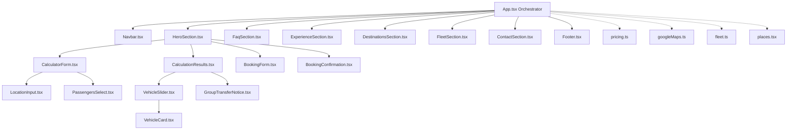

# Zephyr Transfer — Architecture & Codebase Map

> **Comprehensive Technical Documentation & Component Mapping**
> 
> This document details the cascading modular architecture of the Zephyr Transfer platform, specifying file locations, core responsibilities, state dependencies, and data flows.

---

## 1. High-Level Architecture

The project is architected with a strict separation of concerns, dividing application logic into **services**, **constants**, **domain types**, **layout blocks**, **isolated page sections**, and **reusable interactive subcomponents**.



---

## 2. Directory Structure & File Mapping

### 2.1 Types (`src/types/`)

| File Path | Description & Responsibility | Affected Areas / Consumers |
| :--- | :--- | :--- |
| `src/types/index.ts` | Central TypeScript interface definitions: `VehicleSpec`, `PassengerOption`, `PriceResult`, `SelectedVehicle`, `BookingStep`, `ClientFormData`, `ClientFormErrors`, `ContactFormData`, `NavItem`, `FAQItem`. | Used across the entire codebase to guarantee type-safety and eliminate `any` types. |

---

### 2.2 Constants (`src/constants/`)

| File Path | Description & Responsibility | Affected Areas / Consumers |
| :--- | :--- | :--- |
| `src/constants/passengers.ts` | Defines the `passengerOptions` array containing party size ranges (`1-2`, `3-4`, `5-7`, `8-9`, `10+`) and recommended vehicle hints. | Used by `PassengersSelect.tsx` to render custom dropdown choices. |
| `src/constants/fleet.ts` | Contains `vehicleImages` (high-res vehicle imagery) and `vehicleSpecs` (models, passenger capacities, luggage allowances, descriptions). | Consumed by `VehicleCard.tsx`, `FleetSection.tsx`, and `BookingForm.tsx`. |
| `src/constants/places.tsx` | Array of 29 curated European airport hubs, ski resorts, and luxury destinations (`popularPlaces`), plus `getPlaceIcon()` helper rendering Lucide icons (`Plane`, `Anchor`, `Home`, `Building2`, `MapPin`). | Consumed by `LocationInput.tsx` for intelligent autocomplete. |
| `src/constants/faq.tsx` | Array of FAQ items with rich JSX answers detailing vehicle assignments, English proficiency, refreshments, Venice boat transfers, luggage, and cancellation policies. | Consumed by `FaqSection.tsx`. |
| `src/constants/navigation.ts` | Navigation links (`navItems`) with section IDs, and `alpineRoutes` estimates. | Consumed by `Navbar.tsx` and `Footer.tsx`. |

---

### 2.3 Services (`src/services/`)

| File Path | Description & Responsibility | Affected Areas / Consumers |
| :--- | :--- | :--- |
| `src/services/googleMaps.ts` | Provides `loadGoogleMaps()` (dynamic script injection with singleton promise), `formatLocationQuery()` (normalizes Cyrillic/common Italian names), and `resolveClientGoogleDistance()` (direct browser fallback for Google DistanceMatrix / DirectionsService on GitHub Pages). | Invoked by `App.tsx` during distance calculation and quote estimation. |

---

### 2.4 Calculator & Booking Subcomponents (`src/components/calculator/`)

| File Path | Description & Responsibility | Props / Key State |
| :--- | :--- | :--- |
| `PassengersSelect.tsx` | Custom dropdown matching autocomplete styling. Features **pixel-perfect vertically centered `Users` icon**, gold active highlights, party size header, and click-outside closing. | `passengers`, `setPassengers`, `isOpen`, `setIsOpen`, `onFocusCloseOthers`. |
| `LocationInput.tsx` | Reusable location input with custom translucent dropdown. Automatically filters matching destinations and suppresses empty lists. Closes on click-outside or Escape. | `label`, `icon`, `value`, `onChange`, `placeholder`, `isOpen`, `setIsOpen`, `onFocusCloseOthers`. |
| `CalculatorForm.tsx` | Grid combining Origin, Destination, Passengers dropdown, and "Calculate Route" button. Coordinates mutually exclusive dropdown opening. | `from`, `to`, `passengers`, `loading`, `onCalculate`. |
| `VehicleCard.tsx` | Renders a single vehicle category card with image, category badge, capacity tags, luggage limits, all-inclusive price in EUR, and "Select & Continue" button. | `type`, `price`, `passengers`, `isSelected`, `onSelect`. |
| `VehicleSlider.tsx` | Horizontal scrollable snap carousel with left/right navigation arrows for browsing vehicle classes. Automatically filters van/minibus classes when passengers $\ge 5$. | `prices`, `passengers`, `selectedVehicle`, `onSelectVehicle`. |
| `GroupTransferNotice.tsx` | Dedicated VIP Delegation & Convoy notice card rendered when party size is $\ge 10$ passengers, offering direct concierge email and phone links. | None (static presentation). |
| `CalculationResults.tsx` | Results view presenting route statistics (Distance in km, Duration), Origin ➔ Destination indicators, Modify Route button, and vehicle slider. | `from`, `to`, `passengers`, `result`, `selectedVehicle`, `onModifyRoute`, `onSelectVehicle`. |
| `BookingForm.tsx` | Step 2 VIP Reservation form: displays vehicle & journey summary badge (with gold stats and capacity in Passengers), Full Name, Email, International Phone Input (`react-international-phone`), and optional flight notes. | `selectedVehicle`, `result`, `from`, `to`, `passengers`, `onBackToVehicles`, `onSubmitBooking`, `bookingSending`. |
| `BookingConfirmation.tsx` | Step 3 confirmation card displaying the generated `ZEP-XXXXXX` reference code, trip summary, WhatsApp concierge connection, and "Book Another Transfer" button. | `bookingRefCode`, `selectedVehicle`, `result`, `from`, `to`, `onBookAnother`. |

---

### 2.5 Page Sections (`src/components/sections/`)

| File Path | Description & Responsibility | Props / Integrations |
| :--- | :--- | :--- |
| `HeroSection.tsx` | Top visual hero container with Amalfi Coast background, luxury badge, hero heading, and the liquid-glass calculator box coordinating steps (`!result` ➔ `vehicles` ➔ `form` ➔ `success`). | Orchestrates `CalculatorForm`, `CalculationResults`, `BookingForm`, and `BookingConfirmation`. |
| `FaqSection.tsx` | Frequently Asked Questions section featuring an interactive animated accordion with amber glowing active states and custom numbers. | Self-contained state (`openFaq`, `toggleFaq`). Uses `faqs` from `constants/faq.tsx`. |
| `ExperienceSection.tsx` | "The Zephyr Standard" section highlighting Absolute Punctuality, Local Mastery, and Pristine Fleet with high-res editorial imagery. | Pure presentation component. |
| `DestinationsSection.tsx` | Curated Itineraries bento grid (Rome, Milan, Florence). Each card includes a direct "Quote Route" trigger that updates calculator inputs and scrolls up. | `onSelectRoute(origin, dest)`, `onExploreAllRoutes()`. |
| `FleetSection.tsx` | "Our Fleet Classes" showcase. Preserves the stylized subdued amber ambient background glow with responsive desktop diffusion. | Uses `vehicleImages` from `constants/fleet.ts`. |
| `ContactSection.tsx` | "Connect With Us" section featuring the Italian Chauffeur with BMW background image, translucent dark overlay, interactive inquiry form, and direct contact cards. | Self-contained inquiry form state with simulated 15-minute dispatch confirmation. |

---

### 2.6 Layout (`src/components/layout/`)

| File Path | Description & Responsibility | Props / Key State |
| :--- | :--- | :--- |
| `Navbar.tsx` | Fixed header with translucent glassmorphism (`nav-blur`), brand logo, desktop navigation links with spring-animated active indicator (`activeNavIndicator`), Book Now CTA, and responsive mobile drawer. | `activeSection`, `onScrollToSection(e, id)`, `onScrollToCalculator()`. |
| `Footer.tsx` | Global dark footer with brand mark, fleet categories, direct contact channels, service standards, liability badge, and legal links. | Pure presentation component. |

---

### 2.7 Application Core

| File Path | Description & Responsibility |
| :--- | :--- |
| `src/App.tsx` | **Main Application Orchestrator**: Manages top-level state (`from`, `to`, `passengers`, `result`, `selectedVehicle`, `bookingStep`, `activeSection`), listens to URL parameters (`?from=&to=&passengers=`), handles route calculation, runs the ScrollSpy listener, and renders section components sequentially. |
| `src/pricing.ts` | Domain transfer pricing algorithms, Cyrillic & airport alias detection (`detectOrigin`, `detectDestination`), fixed ski route tables (`skiRoutesDistanceDuration`), and tiered rate formulas (`calculateTransferPrices`). |
| `src/main.tsx` | React 19 entry point mounting the `<App />` component into `#root`. |
| `src/index.css` | Tailwind CSS imports, custom glassmorphism styles (`.liquid-glass`, `.glass-card`), gold glows (`.amber-glow`), and custom scrollbar styles. |

---

## 3. Booking Lifecycle & Data Flow

```text
1. INITIAL STATE
   User lands on page (or via Google Ads URL parameters).
   App.tsx initializes: from='', to='', passengers=1, result=null, bookingStep='vehicles'.

2. CALCULATION
   User inputs locations or selects from autocomplete -> clicks "Calculate Route".
   handleCalculate() checks:
     a) Fixed ski resort route database (casing & Cyrillic insensitive).
     b) City-airport pairs static lookup table.
     c) Local Express backend proxy (/api/distance).
     d) Client-side Google Maps DistanceMatrix/DirectionsService (GitHub Pages mode).
   Returns distance & duration -> calculateTransferPrices() computes rates -> setResult(data).

3. VEHICLE SELECTION (Step 1 -> Step 2)
   User clicks "Select & Continue" on desired vehicle (e.g. Business Sedan).
   handleSelectVehicle() sets selectedVehicle and switches bookingStep='form'.
   Viewport remains stable (no unwanted auto-scrolling).

4. VIP RESERVATION FORM (Step 2 -> Step 3)
   User enters Name, Email, and Phone (validated with international dial-code & libphonenumber-js).
   On submit: bookingSending=true -> 1s dispatch simulation -> generates code ZEP-XXXXXX.
   Switches bookingStep='success'.

5. CONFIRMATION & RESET
   User views confirmation card with direct WhatsApp concierge trigger.
   Clicking "Book Another Transfer" resets result=null, bookingStep='vehicles', ready for new route.
```

---

## 4. Maintenance & Extension Guide

### How to Add a New Vehicle Class
1. Open `src/constants/fleet.ts`.
2. Add image URL to `vehicleImages["New Class"]`.
3. Add specifications to `vehicleSpecs["New Class"]` (`model`, `capacity`, `luggage`, `desc`).
4. Update pricing algorithm in `src/pricing.ts` if a custom rate multiplier is required.

### How to Add a New Ski Resort or Airport
1. Open `src/constants/places.tsx` and add the name to `popularPlaces`.
2. In `src/pricing.ts`, register the alias in `detectDestination()` and distances in `skiRoutesDistanceDuration`.

### How to Add a New FAQ Item
1. Open `src/constants/faq.tsx`.
2. Append a new object `{ question: "...", answer: (...) }` to the `faqs` array. The accordion will automatically render it with styled numbering.
